# LR6
## Лабораторная работа №6

<h2 align="center"> Цели лабораторной работы</h2>
Изучение базовых возможностей системы
управления версиями, опыт работы с Git Api, опыт работы с локальным и
удаленным репозиторием.

<h2 align="center"> Основная часть</h2>

### 1. Профиль: https://github.com/Switcherq

### 2. Сделать копию в личное хранилище из https://github.com/Kurtyanik/LR6/ (Fork)

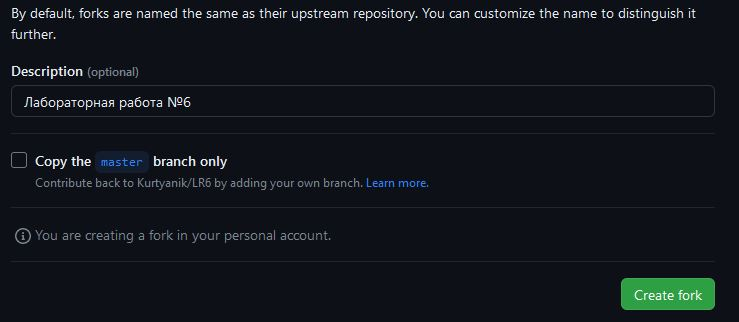
<h4 align="center">Рисунок 1 - Создание форка</h4>

### 3. Установить Git (https://git-scm.com/)

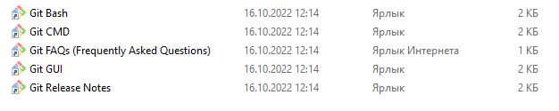
<h4 align="center">Рисунок 2 - Установка Git</h4>

### 4. После установки настроить клиент git, введя имя пользователя (Группа Фамилия И.О.) и email
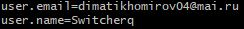
<h4 align="center">Рисунок 3 - Имя пользователя и почта</h4>
### 5. Клонировать свой личный удалённый репозиторий на компьютер

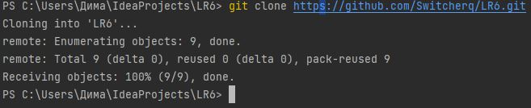

<h4 align="center">Рисунок 4 - Имя пользователя и почта</h4>
### 6. Добавить файл через интерфейс GitHub. Подтянуть изменения в локальный репозиторий.

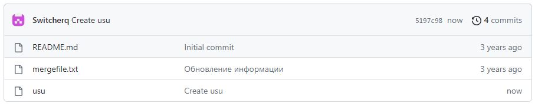
<h4 align="center">Рисунок 5 - Создание файла через интерфейс Github</h4>

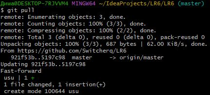

<h4 align="center">Рисунок 6 - Получение изменений</h4>
### 7. Получить историю операций для каждой из веток.

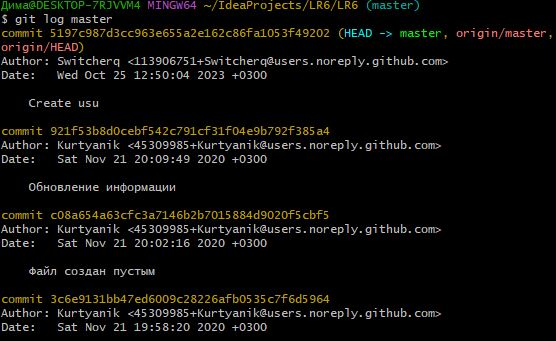
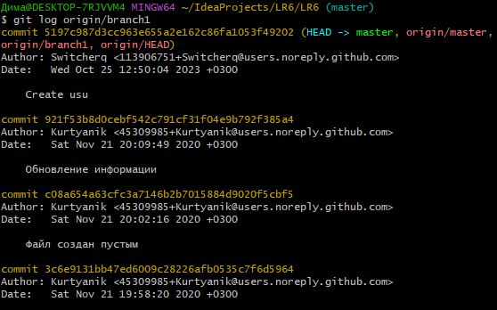

<h4 align="center">Рисунок 7 - Получение истории операций</h4>
### 8. Просмотреть последние изменения.

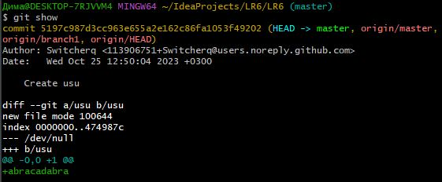

<h4 align="center">Рисунок 8 - Просмотр последних изменений</h4>
### 9. Выполнить слияние в ветку master, разрешив конфликт (можно использовать специальные редакторы или графический интерфейс git).

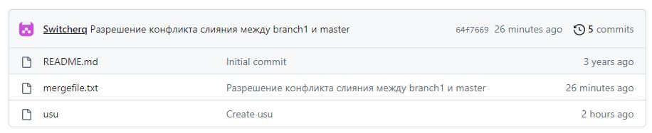

<h4 align="center">Рисунок 9 - Разрешение конфликта и выполнение слияния</h4>
### 10. Удалить побочную ветку после успешного слияния.

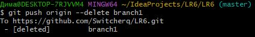
<h4 align="center">Рисунок 10 - Удаление ветки</h4>
### 11. Сделать изменения и зафиксировать их, оставляя комментарии, несколько раз

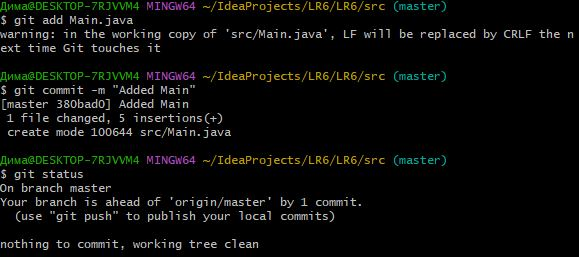
<h4 align="center">Рисунок 11 - Список коммитов</h4>
### 12. Сделать откат коммита

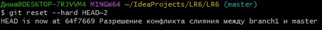
<h4 align="center">Рисунок 12 - Откат коммита</h4>

### 13. Создать ветку для отчёта

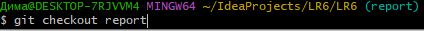
<h4 align="center">Рисунок 13 - Создание ветки</h3>
### 14. Начать оформлять отчёт в файле README.md
### При написании отчёта периодически делать коммиты, не забывать комментировать.

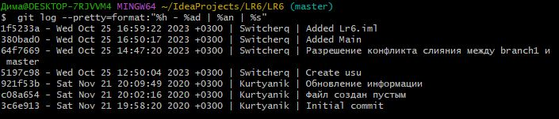

<h4 align="center">Рисунок 14 - Списки изменений</h4>
### 15. Получить историю операций в форматированном виде (сокращённый хэш + дата + имя автора + комментарий). Добавить её в отчёт и сделать финальную фиксацию изменений

<h2 align="center"> Вывод </h2>
В ходе выполнения лабораторной работы:
<ul>  
<li>Изучен интерфейс GitHub</li>
<li>
Использованы команды гит, такие как:
<ul>
<li>
git config --list --show-origin - Просмотр глобальных настроек Git на компьютере 
</li>
<li>
git clone - Клонирование удалённого репозитория 
</li>
<li>
git pull origin master - Применение изменений  
</li>
<li>
git log и git log origin/branch1 - Посмотреть историю определённых веток 
</li>
<li>
git show - Посмотреть изменения 
</li>
<li>
git add - Добавить файл в список отслеживаемых гитом  
</li>
<li>
git commit - Создание коммита  
</li>
<li>
git push origin --delete branch1 - Удаление ветки  
</li>
<li>
git status - Статус применения изменений  
</li>
<li>
git reset --hard HEAD~2 - Откат коммитов относительно самого последнего  
</li>
<li>
git checkout report - Создание ветки  
</li>
<li>
git log --pretty=format:"%h - %ad | %an | %s" - Форматированный вывод истории  
</li>
</ul>
</li>
</ul>